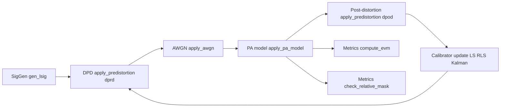

# Figure 4 System Structure (Current Implementation)

This document reflects the current code structure and the signal path implemented in the Python project.

## 1) Current block-level connectivity



Notes:
- The software flow is fully modeled in code (no direct VSG/VSA hardware drivers in this repository).
- The calibrator state is fed back into the next predistortion step through updated coefficients.

---

## 2) Implemented iteration flow (orchestrator)

1. Generate TX IQ with `siggen.SigGen.gen_lsig`.
2. Apply predistortion using current calibrator coefficients.
3. Add channel noise via `channel.awgn.apply_awgn`.
4. Pass through PA nonlinearity model `channel.pa_model.apply_pa_model`.
5. Apply post-distortion path for estimator input.
6. Update calibrator (`cal.calibrator`) using selected estimator mode.
7. Compute quality metrics (`metrics.evm`, `metrics.mask`).
8. Return `IterationResult` with status, metrics, and IQ traces.

---

## 3) Current repository structure

```text
code/
├─ pyproject.toml
├─ README.md
├─ filter_test.asv
├─ docs/
│  └─ figure4_system_structure.md
├─ src/
│  └─ dpd_ml_project/
│     ├─ __init__.py
│     ├─ __main__.py
│     ├─ config.py
│     ├─ main.py
│     ├─ cal/
│     │  ├─ __init__.py
│     │  ├─ calibrator.py
│     │  ├─ estimator_kal.py
│     │  ├─ estimator_ls.py
│     │  └─ estimator_rls.py
│     ├─ channel/
│     │  ├─ __init__.py
│     │  ├─ awgn.py
│     │  └─ pa_model.py
│     ├─ dpd/
│     │  ├─ __init__.py
│     │  ├─ basis_qm.py
│     │  └─ dpd.py
│     ├─ metrics/
│     │  ├─ __init__.py
│     │  ├─ evm.py
│     │  └─ mask.py
│     ├─ ml_gru/
│     │  ├─ __init__.py
│     │  ├─ gru_ml.py
│     │  └─ gru_ml - Copy.txt
│     ├─ orchestrator/
│     │  ├─ __init__.py
│     │  ├─ dpd_analysis.py
│     │  └─ dpd_pipeline.py
│     └─ siggen/
│        ├─ __init__.py
│        └─ SigGen.py
└─ tests/
   ├─ test_bypass.py
   ├─ test_cal_ewrls.py
   ├─ test_cal_kal.py
   ├─ test_channel_model.py
   ├─ test_dpd.py
   ├─ test_main.py
   ├─ test_metrics.py
   ├─ test_siggen.py
   ├─ test_train_gru.py
   └─ results/
```

---

## 4) Module interface map (current)

- `siggen -> dpd`: TX IQ vector (`complex ndarray`).
- `dpd -> channel.awgn`: predistorted TX IQ.
- `channel.awgn -> channel.pa_model`: noisy PA input IQ.
- `channel.pa_model -> dpd (dpod path)`: PA output IQ for post-distortion processing.
- `dpd + pa_model outputs -> cal.calibrator`: estimator update inputs.
- `pa_model output -> metrics`: EVM and spectral mask checks.
- `cal.calibrator -> dpd`: updated coefficients for next loop/iteration.

This is the current implemented structure as of this revision.
